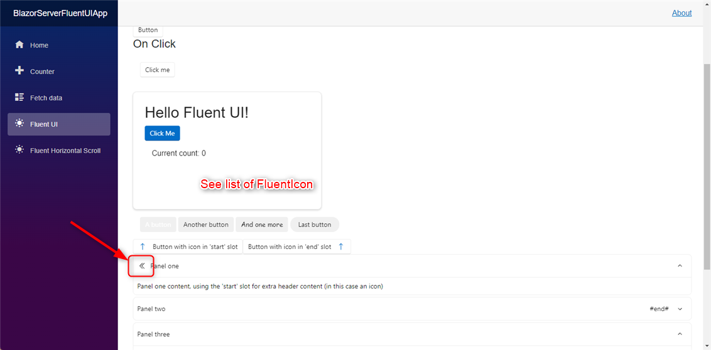

## Fluent UI for Blazor

[Microsoft FluentUI for Blazor](https://brave-cliff-0c0c93310.azurestaticapps.net/)

## Big Bug on FluentIcon 

While trying to use : FluentAccordion with FluentIcon I add a stinks message :

> ** Warning **
> An unhandled exception occurred while processing the request.
> ArgumentException: The requested icon (Globe, Size12, Regular) is not available in the collection
> Microsoft.Fast.Components.FluentUI.FluentIcon.OnParametersSet() in FluentIcon.cs, line 92

If I clicked on FluentIcon definition :

```csharp
    public static List<IconModel> LibraryUsedIcons = new()
    {
        new IconModel("ArrowSortUp", IconSize.Size20, IconVariant.Regular),
```

Using ArrowSortUp it works !



## Trying to work on icons 

[Find the way to use BootStrap Icons for Blazor](https://github.com/windperson/BlazorBootstrapIconsdDemo)


