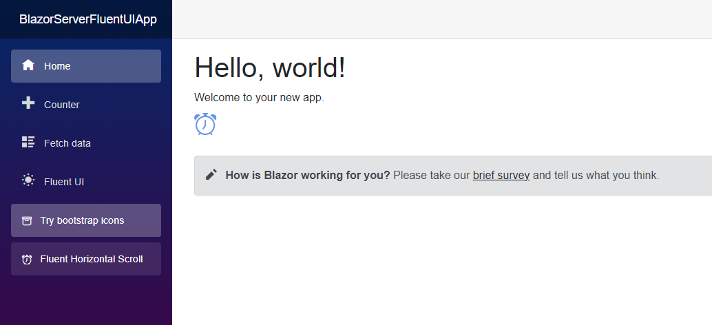
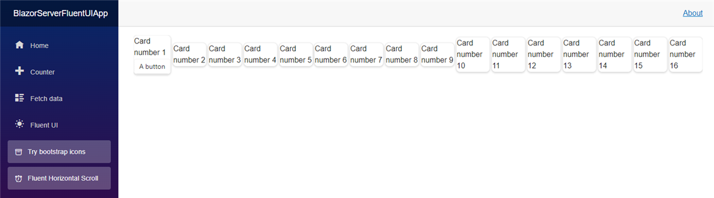
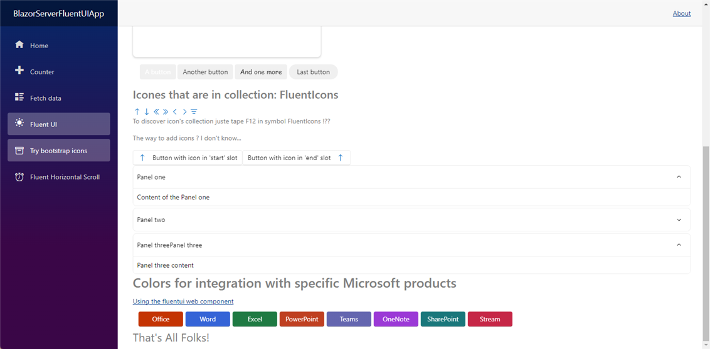

## BlazorServer FluentUI App

An Application in Blazor C# using FluentUI thanks to Nuget

## Requirements

I started with:
- Visual Studio 2022 Community

## References

[Microsoft - FluentUI for Blazor](https://brave-cliff-0c0c93310.azurestaticapps.net/)

[ASP.NET C# - FluentUI for Balzor](https://asp-dotnet-csharp.sodevlog.com/2023/02/fluentui-for-blazor.html)

## Big Bug on FluentIcon

While trying to use : FluentAccordion with FluentIcon I add a stinks message :

> **Warning**
> An unhandled exception occurred while processing the request.
> ArgumentException: The requested icon (Globe, Size12, Regular) is not available in the collection
> Microsoft.Fast.Components.FluentUI.FluentIcon.OnParametersSet() in FluentIcon.cs, line 92

If I clicked on FluentIcon definition :

```csharp
    public static List<IconModel> LibraryUsedIcons = new()
    {
        new IconModel("ArrowSortUp", IconSize.Size20, IconVariant.Regular),
```

Using ArrowSortUp it works !


## Trying to work on icons 

[Find the way to use BootStrap Icons for Blazor](https://github.com/windperson/BlazorBootstrapIconsdDemo)

Using BootStrap Icon for NavMenu



## A Page for FluentHorizontalScroll

Don't work 



## More work on FluentUI for Blazor

Obviously it's a little bit disapointing, some works some don't




